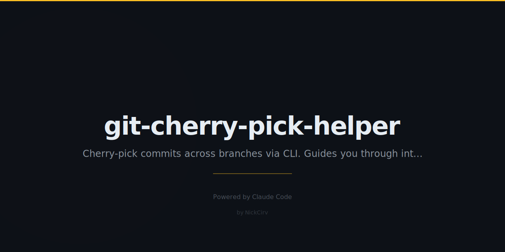

# git-cherry-pick-helper

Interactive cherry-pick helper for Git — browse commits across branches in a terminal TUI and cherry-pick them with full conflict guidance.

Zero external dependencies. Pure Node.js ES modules. Node 18+.

## Install

```bash
npm install -g git-cherry-pick-helper
```

Or use directly without install:

```bash
npx git-cherry-pick-helper
```

## Usage

```
gcph                         Browse all branches, select commits to cherry-pick
gcph <branch>                Browse commits from a specific branch
gcph --search "fix"          Filter commits by message
gcph --since "1 week ago"    Limit to recent commits
gcph pick <hash> [hash2...]  Non-interactive cherry-pick one or more commits
gcph status                  Show conflict status and resolution guide
gcph continue                Continue after resolving conflicts
gcph abort                   Abort current cherry-pick
```

## TUI Controls

| Key | Action |
|-----|--------|
| `↑` / `↓` or `j` / `k` | Navigate commits |
| `Space` | Select / deselect commit |
| `Enter` | Cherry-pick selected commits |
| `p` | Toggle preview pane (shows diff) |
| `q` / `Escape` | Quit |

## Examples

```bash
# Browse all branches interactively
gcph

# Browse commits from a specific branch
gcph feature/my-branch

# Filter commits by keyword
gcph --search "hotfix"

# Show only commits from the last 3 days
gcph --since "3 days ago"

# Combine: search on a specific branch
gcph main --search "bug"

# Non-interactive: cherry-pick specific hashes
gcph pick abc1234 def5678

# Check status when conflicts occur
gcph status

# After resolving conflicts:
gcph continue

# Give up and go back:
gcph abort
```

## Conflict Resolution Workflow

When a cherry-pick hits conflicts:

1. Run `gcph status` — shows conflicted files and step-by-step guide
2. Open each conflicted file and resolve `<<<<< ===== >>>>>` markers
3. Stage the resolved files: `git add <file>`
4. Run `gcph continue` to complete the cherry-pick
5. Or run `gcph abort` to cancel entirely

## Security

- All git commands run via `execFileSync` / `spawnSync` with explicit argument arrays — no shell injection possible
- No `exec` or `execSync` with string interpolation
- No hardcoded secrets or credentials
- No external network calls

## Requirements

- Node.js 18+
- Git installed and available in PATH
- Must be run inside a git repository

## License

MIT
